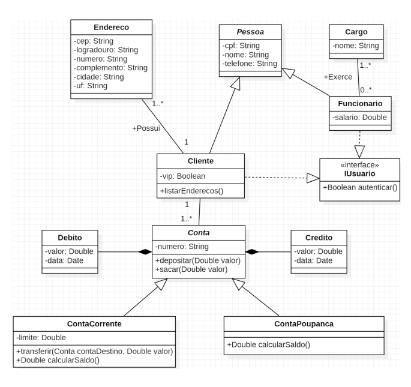

# iuul-desafio-3
## Desenvolvimento de aplicação OO utilizando Typescript

## Instruções
● A aplicação deve ser desenvolvida individualmente. 
● Data de entrega: 26/07/2023 
● A aplicação deve ser versionada e disponibilizada no github. 

## Descrição
Esse desafio tem como objetivo exercitar conceitos de orientação a objetos na prática utilizando
TypeScript. O aluno deverá implementar uma aplicação console em typescript (veja exemplo em
<https://github.com/vidigal/exemplo-typescript>) de forma a representar as classes propostas
juntamente com seus relacionamentos conforme diagrama a seguir. A seguir o aluno deverá fazer
o que se pede.

## Requisitos
1. **Criação das Classes Abstratas:** as Classes Conta e Pessoa são classes abstratas, isto é,
não podem instanciar objetos, mas somente auxiliar na definição de outras classes.
2. **Criação da interface IUsuario:** a interface IUsuario possui apenas a assinatura de um
método. Esse método, quando implementado nas classes que realizam a interface, deve
retornar apenas True.
3. **Criação das Classes Concretas:** as classes concretas são todas as demais classes. Repare
que algumas delas possuem relacionamento de herança com as classes abstratas existentes
no modelo. 
  a. **Método listarEnderecos() da classe Cliente:** o método deve imprimir no console
     todos os endereços armazenados para um cliente. 
  b. **Método depositar() da classe Conta:** cria um objeto do tipo Credito vinculado à
     conta que está recebendo o depósito. 
  c. **Método sacar() da classe Conta:** cria um objeto do tipo Debito vinculado à conta
     que está sofrendo o saque. (conta não pode ter saldo negativo além do seu limite). 
  d. **Método transferir() da classe ContaCorrente:** retira dinheiro da conta corrente de
     origem e envia para uma conta destino. (a conta não pode ter saldo negativo além
     do seu limite). 
  e. **Método calcularSaldo() da ContaPoupanca:** retorna a soma de todos os créditos
     e subitraído pela soma de todos os débitos. 
  f. **Método calcularSaldo() da ContaCorrente:** retorna a soma de todos os créditos e
     subitraído pela soma de todos os débitos. Após, soma o valor do limite. Ao final,
     retorna o valor. 
4. **Criação dos Relacionamento entre Classes:** as linhas que ligam as classes são chamadas
de associação. A existência de uma associação entre a Classe A e a Classe B significa, em
programação, que existirá um atributo da Classe B na definição da Classe A e vice-versa (a
depender da navegabilidade atribuída no modelo → direção da seta). As cardinalidades
(números presentes nas associações) dizem respeito a quantos objetos da Classe B podem
existir se ligando com um objeto da classe A (e vice-versa). Esses números vão auxiliar na
definição da estrutura de dados a ser utilizada para representar o atributo de uma determinada
classe.
5. **Criação de Objetos:** 
  ● **Aplicação 1** 
    ○ Crie dois funcionários do banco, um gerente e um atendente. 
  ● **Aplicação 2** 
    ○ Crie um cliente e adicione 3 endereços a ele 
    ○ Imprima os endereços deste cliente 
  ● **Aplicação 3** 
    ○ Crie um cliente que possua uma ContaCorrente 
    ○ Efetue três depósitos de 100 nessa ContaCorrente 
    ○ Efetue um saque de 50 reais nessa ContaCorrente 
    ○ Imprima o valor do saldo dessa ContaCorrente 
  ● **Aplicação 4**
    ○ Crie um cliente que possua uma ContaCorrente 
    ○ Efetue um depósito de 1000 nessa ContaCorrente 
    ○ Crie um cliente que possua uma ContaPoupanca 
    ○ Efetue um depósito de 1000 reais nesta ContaPoupanca 
    ○ Efetue uma transferência de 500 reais da ContaCorrente para ContaPoupanca 
    ○ Exiba o saldo das duas contas 
  ● **Aplicação 5** 
    ○ Crie um cliente que possua uma ContaCorrente 
    ○ Efetue um depósito de 300 nessa ContaCorrente 
    ○ Defina o valor do limite da ContaCorrete para 100 reais 
    ○ Crie um cliente que possua uma ContaCorrente 
    ○ Efetue um depósito de 100 reais nesta ContaCorrente 
    ○ Tente efetuar uma transferência de 1000 reais da primeira ContaCorrente para a
      segunda ContaPoupanca 

Obs.: Você está livre para definir novos atributos/métodos que julgar necessário para apresentar o
que se pede. 

## Critérios de Avaliação
● Qualidade do código: 
  o Indentação 
  o Definição das classes abstratas e concretas 
  o Representação adequada dos conceitos de abstração, encapsulamento e herança da orientação a objetos 
  o Definição adequada dos atributos e métodos das classes 
  o Definição adequada das associações existentes entre as classes 
● Completude: implementação das funcionalidades/páginas descritas anteriormente. 
● Proatividade** 

**Importante:** Não é necessária a criação de arquivos html e css para a realização do Desafio #3.
O foco da unidade é tão e simplesmente focar nos conceitos de orientação a objetos usando
typescript. Repositório com exemplo de criação de aplicação typescript usando node:
<https://github.com/vidigal/exemplo-typescript>
